# TalentHunt 🔍

[](https://talenthunt-nnyi.onrender.com/docs)
[](https://www.python.org/)
[](https://fastapi.tiangolo.com/)
[](LICENSE)

**AI-Powered SHL Assessment Recommendation Engine**

> 💡 **Note:** For the best experience with the Streamlit demo, we recommend viewing it in a browser with dark mode enabled.

---

## 🚀 Important Links

| Resource | Link |
|----------|------|
| 🔹 **Live API** | [https://talenthunt-nnyi.onrender.com](https://talenthunt-nnyi.onrender.com) |
| 📚 **API Documentation** | [https://talenthunt-nnyi.onrender.com/docs](https://talenthunt-nnyi.onrender.com/docs) |
| 🎯 **Streamlit Demo** | [Launch App](https://talenthunt-nnyi.onrender.com) |

---

## 📖 Overview

TalentHunt is an AI-powered recommendation engine designed to streamline the process of selecting SHL assessments for specific job roles. By leveraging natural language processing and semantic search, it helps HR professionals quickly identify the most relevant tests from SHL's extensive catalog of **400+ assessments**, reducing manual effort and improving hiring efficiency.

### 🎯 The Challenge

HR teams often face difficulties in aligning job requirements with the right SHL assessments. This mismatch can lead to:
- Prolonged hiring cycles
- Suboptimal candidate evaluations
- Increased operational costs
- Manual search through hundreds of assessments

### 💡 Our Solution

TalentHunt addresses this by automating the discovery process:
1. Scrapes SHL's product catalog for comprehensive assessment data
2. Converts assessment descriptions into vector embeddings using NLP
3. Performs semantic matching against job descriptions
4. Delivers tailored recommendations with actionable HR insights

---

## 🛠️ Technology Stack

| Layer | Technology |
|-------|------------|
| **Backend** | FastAPI with Uvicorn |
| **Vector Database** | ChromaDB for semantic search |
| **Embeddings** | Sentence-Transformers (`all-MiniLM-L6-v2`) |
| **AI Insights** | Google Gemini API (`gemini-2.0-flash`) |
| **Data Scraping** | BeautifulSoup + Requests |
| **Frontend** | Streamlit |
| **Deployment** | Render (API) |

---

## ⚙️ How It Works

The system follows a structured RAG (Retrieval-Augmented Generation) pipeline:

```mermaid
graph TB
    subgraph "📥 Data Preparation"
        A[Scrape SHL Website] --> B[Clean & Parse Data]
        B --> C[Store as JSON]
        C --> D[Generate Embeddings]
        D --> E[Store in ChromaDB]
    end
    
    subgraph "🔍 Query Processing"
        F[User Query / Job Description] --> G[Generate Query Embedding]
        G --> H[Semantic Search in ChromaDB]
        H --> I[Rank Top-10 Matches]
    end
    
    subgraph "🤖 AI Enhancement"
        I --> J[Send to Gemini API]
        J --> K[Generate HR Insights]
        K --> L[Return Recommendations]
    end
    
    E --> H
    
    style A fill:#e8f5e9,stroke:#43a047
    style F fill:#e3f2fd,stroke:#1e88e5
    style J fill:#fff3e0,stroke:#f57c00
    style L fill:#ffebee,stroke:#e53935
```



### Pipeline Steps:

1. **Data Collection** (`scraper.py`): Scrapes 400+ assessments from SHL's catalog across 32 pages
2. **Vector Database** (`rag.py`): Transforms descriptions into embeddings and stores in ChromaDB
3. **API Processing** (`api.py`): Handles job description queries and retrieves ranked assessments
4. **Insight Generation**: Gemini API provides key skills, job level fit, and usage recommendations
5. **User Interface** (`streamlit_app.py`): Interactive frontend for exploring recommendations

---

## ✨ Core Features

| Feature | Description |
|---------|-------------|
| 🔍 **Semantic Search** | Matches job requirements using vector similarity for context-aware recommendations |
| 🤖 **AI Insights** | Generates summaries of required skills, ideal candidate levels, and implementation guidance |
| 📊 **Rich Metadata** | Returns duration, languages, job levels, remote testing support, and test types |
| 🌐 **URL Support** | Accepts both text descriptions and job posting URLs (auto-scraped) |
| ⚡ **Fast Response** | Optimized ChromaDB queries return results in seconds |

---

## 🚀 Getting Started

### API Access

The recommendation endpoint is live and ready for integration.

**Endpoint:** `POST https://talenthunt-nnyi.onrender.com/recommend`

**Request Body:**
```json
{
  "text": "Looking for a senior Python developer with 5+ years experience",
  "use_ai": true
}
```

**Response:**
```json
[
  {
    "name": "Python (New)",
    "url": "https://www.shl.com/products/product-catalog/view/python-new/",
    "description": "Multi-choice test that measures knowledge of Python programming...",
    "duration": "Approximate Completion Time in minutes = 11",
    "languages": "English (USA)",
    "job_level": "Mid-Professional, Professional Individual Contributor",
    "remote_testing": "🟢",
    "adaptive_support": "🔴",
    "test_type": "K",
    "score": 0.234,
    "ai_insights": "1. Key skills: Python programming, databases, modules\n2. Ideal level: Mid-level developers\n3. Best use: Technical screening for Python roles"
  }
]
```

### Local Development

```bash
# Clone the repository
git clone https://github.com/ArnavSingha/talenthunt.git
cd talenthunt

# Install dependencies
pip install -r requirements.txt

# Set up environment variables
echo "GOOGLE_API_KEY=your-gemini-api-key" > .env

# Rebuild vector database (optional)
python -m app.rag

# Start the API server
uvicorn app.api:app --reload

# In another terminal, start Streamlit
streamlit run streamlit_app.py
```

---

## 📁 Project Structure

```
talenthunt/
├── app/
│   ├── api.py           # FastAPI endpoints
│   ├── rag.py           # ChromaDB vector database setup
│   ├── scraper.py       # SHL catalog scraper
│   └── chroma_db/       # Persistent vector storage
├── data/
│   └── shl_assessments_complete.json  # 400+ assessments
├── streamlit_app.py     # Frontend application
├── generate_submission.py  # Evaluation CSV generator
├── requirements.txt     # Python dependencies
├── render.yaml          # Render deployment config
└── Procfile            # Process configuration
```

---

## 📊 Assessment Data Schema

Each assessment in the database includes:

| Field | Description |
|-------|-------------|
| `name` | Assessment title |
| `url` | Direct link to SHL catalog |
| `description` | Detailed assessment description |
| `duration` | Completion time in minutes |
| `languages` | Available languages |
| `job_level` | Target job levels (Entry, Mid, Senior, etc.) |
| `remote_testing` | 🟢 Supported / 🔴 Not supported |
| `adaptive/irt_support` | IRT/Adaptive testing support |
| `test_type` | Assessment category (K, P, A, B, S, etc.) |

---

## 🔧 Development Insights

During implementation, we encountered and resolved:

| Challenge | Solution |
|-----------|----------|
| **Complex Multi-page Scraping** | Implemented pagination across 32 catalog pages with error handling |
| **API Rate Limits** | Added retry logic and token limits for Gemini API |
| **ChromaDB Path Issues** | Switched to relative paths for Render deployment compatibility |
| **Cold Start Delays** | Implemented 180s timeout with automatic retries |

---

## 📈 Business Impact

| Metric | Improvement |
|--------|-------------|
| ⏱️ Assessment Selection Time | **Up to 80% reduction** |
| 🎯 Recommendation Accuracy | **Semantic matching > keyword search** |
| 📊 Assessment Coverage | **400+ SHL assessments indexed** |
| 🌍 Scalability | **Cloud-based, horizontally scalable** |

---

## 🤝 Contributing

Contributions are welcome! Please feel free to submit a Pull Request.

1. Fork the repository
2. Create your feature branch (`git checkout -b feature/AmazingFeature`)
3. Commit your changes (`git commit -m 'Add some AmazingFeature'`)
4. Push to the branch (`git push origin feature/AmazingFeature`)
5. Open a Pull Request

---

## 📄 License

This project is licensed under the MIT License - see the [LICENSE](LICENSE) file for details.

---

## 👤 Author

**Arnav Singha**

- GitHub: [@ArnavSingha](https://github.com/ArnavSingha)

---

<p align="center">
  <b>TalentHunt</b> - Intelligent Assessment Matching for Modern HR<br>
  Made with ❤️ using FastAPI, ChromaDB & Gemini AI
</p>
